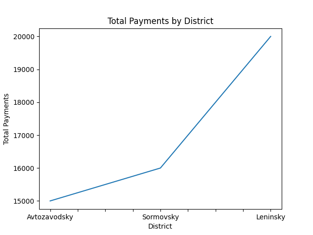

# City Payments Analysis

Pet-project по анализу городских платежей с использованием Python и SQL.

## Стек
- Python
- SQLite
- pandas
- matplotlib

## Задачи проекта
- загрузка данных из БД
- анализ платежей жителей
- агрегация по районам
- визуализация данных
- экспорт аналитического отчёта

## Примеры анализа
- общий оборот платежей
- средний платёж
- топ жителей по платежам
- анализ районов

## Business Insight

По результатам анализа:

- выявлены районы с наибольшим объёмом платежей
- определены жители с максимальной финансовой активностью
- рассчитаны средние показатели платежей
- подготовлен отчёт для дальнейшего использования администрацией

## Visualization



## Запуск

```bash
pip install -r requirements.txt
python report.py
